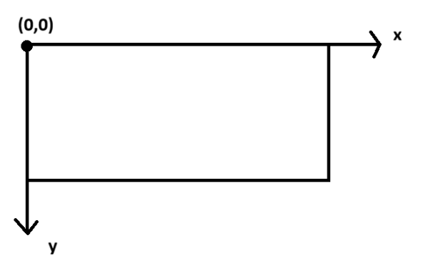

# Rigid Body Simulator

#### Comando para gerar o executável.
- No linux (é preciso baixar o raylib para o linux versão ?):
g++ *.cpp -I./include ./lib_linux/libraylib.a -lGL -lm -lpthread -ldl -lrt -lX11 -o simulador

- No windows
g++ loop.cpp body.cpp -o simulador.exe -I./include -L./lib -lraylibdll -lopengl32 -lgdi32 -lwinmm

raylib.dll na mesma pasta que o exe.

obs. depende do nome da pasta lib apenas.

#### Comando para executar
.\simulador

#### Implementações futuras

é fácil implementar a adição de corpos rígidos, basta adicioná-los ativando o IsStatic

#### Plano Cartesiano das entradas 
